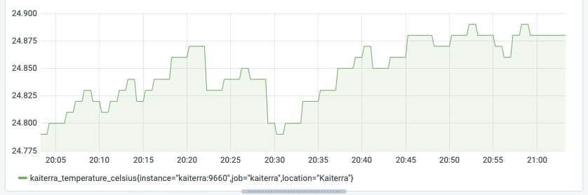
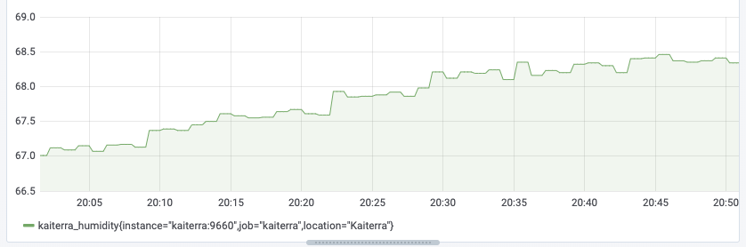
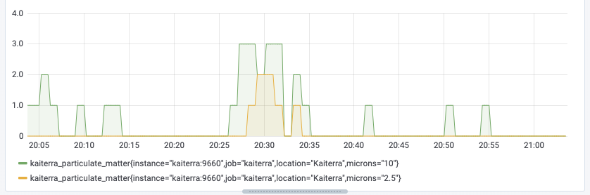

# Kaiterra Laser Egg Exporter

A prometheus.io exporter for Kaiterra Laser Egg Air Quality / Particulate Matter Sensors.

Pushed to [Docker Hub](https://hub.docker.com/r/markhnsn/kaiterra_laser_egg_exporter)

Get an API Key at https://dashboard.kaiterra.cn/.

Find your device UUID in the Kaiterra app.

Combine with Grafana for beautiful graphs:

### Temperature over time:



### Humidity over time:



### Particulate Matter over time:



### Staleness of data:


Example usage:

```shell
    $ go build
    $ ./kaiterra_laser_egg_exporter --addr=:8000 --device_uuid=3d6d04a2-ba9f-11e6-9598-0800200c9a66 --api_key=kOpAgVMnz2zM5l6XKQwv4JmUEvopnmUewFKXQ0Wvf9Su72a9

    $ curl http://localhost:8000/metrics
    ...
    # HELP kaiterra_humidity relative humidity in % (0-100)
    # TYPE kaiterra_humidity gauge
    kaiterra_humidity 60.46
    # HELP kaiterra_particulate_matter PM2.5 or PM10 (µg/m³), post-calibration
    # TYPE kaiterra_particulate_matter gauge
    kaiterra_particulate_matter{microns="10"} 16
    kaiterra_particulate_matter{microns="2.5"} 15
    # HELP kaiterra_rtvoc Total Volatile Organic Compounds (TVOC) in ppb
    # TYPE kaiterra_rtvoc gauge
    kaiterra_rtvoc 486
    # HELP kaiterra_temperature_celsius temperature in Celsius
    # TYPE kaiterra_temperature_celsius gauge
    kaiterra_temperature_celsius 26.74
    # HELP kaiterra_timestamp_seconds Timestamp was measured at. Unix seconds.
    # TYPE kaiterra_timestamp_seconds gauge
    kaiterra_timestamp_seconds 1.580291945e+09
```


Example `docker-compose.yml`:

```yml
version: '3.4'
services:
  kaiterra:
    image: markhnsn/kaiterra_laser_egg_exporter
    restart: always
    ports:
      - "9660:9660"
    command: [
      "--addr", ":9660",
      "--api_key", "kOpAgVMnz2zM5l6XKQwv4JmUEvopnmUewFKXQ0Wvf9Su72a9",
      "--device_uuid", "3d6d04a2-ba9f-11e6-9598-0800200c9a66",
    ]
    volumes:
      - /etc/ssl/certs:/etc/ssl/certs:ro
```

Example `prometheus.yml`:

```yml
scrape_configs:
  - job_name: 'kaiterra'
    static_configs:
      - targets:
        - 'kaiterra:9660'
        labels:
          location: 'Kaiterra'
```
